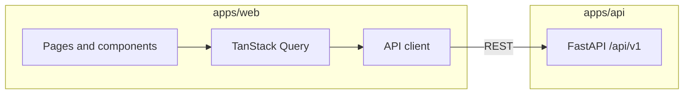

# Frontend Implementation Plan — Kept

References: [doc/prd.md](prd.md), [doc/rfc-001-expense-manager.md](rfc-001-expense-manager.md), and the existing API in [apps/api/](../apps/api/).

---

## Tech stack (from RFC)

| Layer      | Choice                                                                  |
| ---------- | ----------------------------------------------------------------------- |
| **App**    | React 18, Vite, TypeScript                                              |
| **Data**   | TanStack Query (server state), React Hook Form + Zod (forms)            |
| **Charts** | Recharts                                                               |
| **UI**     | Tailwind CSS, shadcn/ui (or similar component library)                 |
| **API**    | **OpenAPI-generated** types and client (see Phase 0); base URL from env |

**Repo layout:** Monorepo; new app at `apps/web/`. API base URL (e.g. `VITE_API_BASE_URL=http://localhost:8000`) for dev; backend may need CORS allowing the web origin (e.g. `http://localhost:5173`).

**Why OpenAPI-generated client:** Keeps request/response types and paths in sync with the backend; avoids manual type drift and typos in URLs/bodies; RFC §6.1 recommends it ("Frontend can use openapi-typescript (or similar) to generate a typed client"). FastAPI already exposes the spec at `/openapi.json`.

---

## Implementation order (one page at a time)

Implement in this order so each page has the APIs and navigation it needs. Each section below is one "page" (or cohesive screen) with a detailed UI description.

---

## Phase 0: Scaffold and app shell

**Goal:** Run a React + Vite + TS app in `apps/web/` with routing, layout, and API client; no feature pages yet.

**Tasks:**

- Create `apps/web/` with Vite + React + TypeScript. Add Tailwind CSS and a component library (e.g. shadcn/ui via its CLI or manual setup).
- Configure path alias (e.g. `@/` → `src/`).
- Add React Router (e.g. v6) with a root layout and placeholder routes: `/`, `/ledger`, `/dashboard`, `/payment-methods`, `/categories`, `/custom-query`. Use a single `Outlet` in the layout for child routes.
- **Generate API client from OpenAPI:** FastAPI exposes the spec at `GET /openapi.json` (and Swagger UI at `/docs`). Use an OpenAPI-based codegen so the frontend stays in sync with the API contract and gets full type safety.
  - **Option A:** Fetch the spec from the running API (e.g. `http://localhost:8000/openapi.json`) at build time via a script, or commit a snapshot of the spec under `apps/web/openapi.json` so generation works without the API running.
  - **Tooling:** Use **openapi-typescript** to generate TypeScript types from the spec, plus **openapi-fetch** (or a small wrapper) for typed request/response; or use **orval** / **openapi-typescript-codegen** to generate both types and a full client. Base URL from `import.meta.env.VITE_API_BASE_URL` (default `http://localhost:8000`); pass it into the generated client so all requests go to the right host.
  - Add an npm script (e.g. `generate:api`) that runs the generator; run it after API changes or in CI so types stay current.
- Add **TanStack Query** provider and a default `QueryClient` (e.g. staleTime 1–2 min for list data).
- **App shell UI (to visualize):**
  - **Desktop:** A persistent **sidebar** on the left (~200–240px wide). At the top, a small logo or "Kept" text. Below it, a vertical list of nav links: **Ledger**, **Dashboard**, **Payment methods**, **Categories**, **Custom query**. Active route is visually highlighted (e.g. background + left border or bold). At the bottom of the sidebar, optional footer (e.g. "v0.1").
  - **Main content area** fills the rest of the viewport; padding (e.g. 24px). Each route renders its page content here.
  - **Mobile (optional for Phase 0):** Collapsible sidebar (hamburger) or bottom nav for the five items; same routes.
- No dashboard/charts content yet; "Dashboard" and "Custom query" can render a simple "Coming soon" or "Dashboard" / "Custom query" heading only.

**Deliverable:** Running `npm run dev` (or `pnpm dev`) in `apps/web` shows the shell and navigation; clicking each link shows the corresponding placeholder.

---

## Phase 1: Payment methods page

**Goal:** Full CRUD for payment methods. This is the first real data page and defines patterns (list, add, edit, delete) for master data.

**API used:**  
`GET /api/v1/payment-methods`, `POST`, `GET /api/v1/payment-methods/{id}`, `PUT`, `DELETE`.  
Request body: `{ name: string, currency: string }`. Response: `{ id, name, currency, active, createdAt }`.

**UI description:**

- **Page title:** "Payment methods" (heading at top of content area).
- **Subtitle/copy:** One line of help text, e.g. "Add cards, cash, UPI, etc. Currency is set per method."
- **List:** A **table** (or card list on very small screens). Columns: **Name**, **Currency**, **Actions**.
  - Each row: name (e.g. "Card"), currency (e.g. "INR"), and an **Actions** cell with **Edit** and **Delete** buttons (or icon buttons).
  - No need to show "active" in the table; API only returns active for list, or you show all and grey out inactive—RFC says "only active shown in dropdowns," so list can show active-only.
- **Empty state:** If the list is empty, show a short message: "No payment methods yet. Add one to use when recording expenses," and a prominent **Add payment method** button.
- **Add / Edit:** A **modal** (or slide-over) with:
  - **Name** — text input, required, max 100 chars, placeholder "e.g. Card, Cash, UPI".
  - **Currency** — text input, required, max 10 chars, placeholder "e.g. INR, USD".
  - **Cancel** and **Save** (or "Create") buttons. On success: close modal, invalidate payment-methods query, show a short success toast if you have a toast system.
- **Delete:** Clicking Delete opens a **confirmation dialog**: "Are you sure you want to remove this payment method? Existing ledger entries will keep showing its name." **Cancel** / **Delete**. On confirm: call `DELETE`; invalidate list; close dialog; optional toast.
- **Primary action:** A button **"Add payment method"** (top-right or above the table) that opens the same modal in "create" mode.

**Deliverable:** User can list, add, edit, and soft-delete payment methods; list and form are wired to the real API.

---

## Phase 2: Categories page

**Goal:** Full CRUD for categories. Mirrors payment methods but with an optional color field.

**API used:**  
`GET/POST /api/v1/categories`, `GET/PUT/DELETE /api/v1/categories/{id}`.  
Request: `{ name: string, color?: string }`. Response: `{ id, name, color, active, createdAt }`.

**UI description:**

- **Page title:** "Categories".
- **Subtitle:** e.g. "Expense categories like Food, Transport, Bills. Optional color is used in charts and ledger."
- **List:** Table with columns: **Name**, **Color**, **Actions**.
  - **Name:** text.
  - **Color:** show a small **color swatch** (e.g. 24×24px circle or square) plus the hex/code if present; if no color, show "—" or "None".
  - **Actions:** Edit, Delete (same pattern as payment methods).
- **Empty state:** "No categories yet. Add one to categorize expenses," plus **Add category** button.
- **Add / Edit modal:**
  - **Name** — required, max 100, placeholder "e.g. Food, Transport".
  - **Color** — optional. Either a **color picker** (native or a small lib) that outputs hex, or a text input for hex (e.g. `#4F46E5`). Max 20 chars. Label: "Color (optional)".
  - **Cancel** / **Save** (or Create).
- **Delete confirmation:** "Are you sure you want to remove this category? Existing entries will keep showing its name." Cancel / Delete.
- **Primary action:** "Add category" button.

**Deliverable:** Full categories CRUD; color optional; list shows swatch + name.

---

## Phase 3: Ledger page (list + add/edit entry + delete)

**Goal:** View cursor-paginated ledger, add/edit entries with category, payment method, and tag suggestions, and soft-delete with confirmation. This is the core data-entry experience.

**API used:**

- `GET /api/v1/ledger-entries` (cursor, limit, optional: dateFrom, dateTo, categoryId, paymentMethodId, type, tags).  
  Response: `{ data: LedgerEntry[], nextCursor: string | null }`.
- `POST /api/v1/ledger-entries`, `GET /api/v1/ledger-entries/{id}`, `PUT`, `DELETE`.
- `GET /api/v1/tag-suggestions?q=` for autocomplete.
- `GET /api/v1/payment-methods`, `GET /api/v1/categories` for dropdowns.

**Ledger entry shape:**  
`date`, `description`, `categoryId`, `categoryName`, `paymentMethodId`, `paymentMethodName`, `currency`, `amount` (signed: negative = refund), `tags[]`, `id`, `createdAt`, `updatedAt`.

**UI description:**

- **Page title:** "Ledger".
- **Subtitle:** "All your expense and refund entries. Newest first."
- **Toolbar (above table):**
  - **Filters (optional in Phase 3, can be minimal):** e.g. **Date from** / **Date to** (date inputs), **Category** (dropdown, "All"), **Payment method** (dropdown, "All"). Apply filters on "Apply" or on change; reset "Clear filters."
  - **Primary action:** **"Add entry"** button (prominent, top-right). Opens Add/Edit modal.
- **Table:** Columns: **Date**, **Description**, **Category**, **Payment method**, **Amount**, **Tags**, **Actions**.
  - **Date:** YYYY-MM-DD (or locale short date).
  - **Description:** plain text; truncate with tooltip if long.
  - **Category:** category name (from API).
  - **Payment method:** payment method name.
  - **Amount:** format as currency (use `currency` from entry); **negative amounts** in red or with a minus and distinct style (refunds).
  - **Tags:** comma-separated or pill-style; if none, "—".
  - **Actions:** **Edit** (opens same modal with prefilled data), **Delete** (opens confirm).
- **Pagination:** If `nextCursor` is present, show a **"Load more"** button at the bottom that fetches the next page with the same filters and appends (or use infinite scroll). When no `nextCursor`, show "No more entries" or hide the button.
- **Empty state:** "No entries yet. Add your first expense or refund." + **Add entry** button. If filters are applied and result is empty: "No entries match the filters. Try changing them."
- **Add / Edit entry modal:**
  - **Date** — date picker, required, default today.
  - **Description** — text input, required, max 500, placeholder "What was this for?".
  - **Category** — **dropdown** (required), options from `GET /api/v1/categories` (active only).
  - **Payment method** — **dropdown** (required), options from `GET /api/v1/payment-methods` (active only).
  - **Amount** — number input, required; allow negative (refund). Optional: show currency from selected payment method next to the field.
  - **Tags** — **multi-value input with suggestions:** as the user types, call `GET /api/v1/tag-suggestions?q=...` and show a dropdown of suggestions; user can pick or type a new tag and add (e.g. Enter or comma). Display selected tags as removable chips/pills. Allow free text (no "only from list" restriction).
  - **Cancel** / **Save** (or "Create entry"). Validation with Zod: required fields, description non-empty, amount number. On success: close modal, invalidate ledger-entries (and optionally tag-suggestions), toast.
- **Delete confirmation:** "Are you sure you want to delete this entry? This cannot be undone." Cancel / Delete. Then invalidate ledger list and dashboard/analytics if already implemented.

**Deliverable:** Full ledger list with optional filters, cursor "Load more," add/edit/delete entry with tag suggestions and dropdowns; amounts and refunds clearly distinguished.

---

## Phase 4: Dashboard page

**Goal:** Summary cards and last entries for a date range; links to detailed charts.

**API used:**  
`GET /api/v1/analytics/dashboard?from=YYYY-MM-DD&to=YYYY-MM-DD`.  
Response: `totalExpense`, `totalRefund`, `entryCount`, `lastEntries` (array of up to 5 ledger entries, same shape as list).

**UI description:**

- **Page title:** "Dashboard".
- **Date range:** At the top, a **date range picker**: "From" and "To" (date inputs). Default: e.g. first day of current month to today (or last 30 days). Max range 366 days (API constraint). On change, refetch dashboard.
- **Summary cards (row of 3):**
  - **Total expense** — large number, formatted as currency (e.g. "₹12,345" or "$1,234"). Subtitle: "Sum of expenses in range."
  - **Total refund** — same format; subtitle "Refunds in range."
  - **Entry count** — integer; subtitle "Transactions in range."
  Cards can be simple boxes with a subtle border or background; use a consistent currency (e.g. from first payment method or a default) if the API doesn't aggregate by currency—RFC says single-currency or per payment method; for dashboard you may show one currency or "mixed" if multiple.
- **Last entries:** Section titled "Recent entries" or "Last entries." Below, a **compact table or list**: same columns as ledger (Date, Description, Category, Payment method, Amount, Tags) but without row actions, or with a single "View in Ledger" link that navigates to `/ledger` (optional). If `lastEntries` is empty, show "No entries in this range."
- **Links to charts:** Below the last entries, a short line: "View **Monthly trend** (bar chart) · **By category** (bar/pie) · **By payment method** (bar/pie)." Each link goes to the Charts page (Phase 5) with the right tab or query (e.g. `/charts?view=monthly`).

**Deliverable:** Dashboard with date range, three summary cards, last 5 entries, and links to charts.

---

## Phase 5: Charts page (monthly, by category, by payment method)

**Goal:** Three chart types with month/range selector and bar/pie toggle where specified.

**APIs used:**

- `GET /api/v1/analytics/monthly-expense?from=&to=` → `{ data: [{ month, totalExpense, totalRefund }] }`.
- `GET /api/v1/analytics/expense-by-category?month=YYYY-MM` → `{ data: [{ categoryId, categoryName, amount }] }`.
- `GET /api/v1/analytics/expense-by-payment-method?month=YYYY-MM` → `{ data: [{ paymentMethodId, paymentMethodName, amount }] }`.

**UI description:**

- **Page title:** "Charts" or "Analytics".
- **Tabs or sub-nav:** Three sections: **Monthly trend**, **By category**, **By payment method**.
- **Monthly trend (first tab):**
  - **Range selector:** "From" and "To" (date inputs). Default e.g. last 6 months. Max 366 days.
  - **Chart:** A **bar chart** (Recharts): x-axis = `month` (e.g. "2025-01"), y-axis = amount. One or two series: e.g. "Expense" (totalExpense) in one color, "Refund" (totalRefund) in another; or stacked/grouped. Tooltip on hover with exact values.
  - **Empty state:** If no data, "No data for this range."
- **By category (second tab):**
  - **Month selector:** Single month picker (YYYY-MM).
  - **Toggle:** **Bar** | **Pie**. Default e.g. Bar.
  - **Bar view:** Bar chart: x-axis = category name, y-axis = amount; bars sorted by amount (desc).
  - **Pie view:** Pie chart: each slice = category, value = amount; legend with category names and amounts.
  - **Empty state:** "No expenses in this month."
- **By payment method (third tab):**
  - Same as "By category": **month selector**, **Bar / Pie** toggle, bar chart and pie chart using payment method name and amount.
  - Empty state: "No expenses in this month."
- **Shared:** Use Recharts components (`BarChart`, `PieChart`, `XAxis`, `YAxis`, `Tooltip`, `Legend`, `Bar`, `Cell` for pie colors). Responsive container; ensure labels don't overflow on small screens.

**Deliverable:** One Charts page with three tabs; monthly bar; category and payment method with bar/pie toggle; all driven by the analytics API.

---

## Phase 6: Custom query page

**Goal:** Total expense for entries that have all selected tags in a date range.

**API used:**  
`GET /api/v1/analytics/custom-by-tags?tags=tag1,tag2&from=YYYY-MM-DD&to=YYYY-MM-DD`.  
Response: `{ totalExpense: number }`.  
Tags: comma-separated; at least one required; max range 366 days.

**UI description:**

- **Page title:** "Custom query".
- **Subtitle:** "Total expense for entries that have all of the selected tags in the chosen date range."
- **Form:**
  - **Tags:** Multi-value input with **tag suggestions** from `GET /api/v1/tag-suggestions?q=...`. Same UX as ledger: type to search, select or add new; display as chips; at least one tag required.
  - **Date range:** "From" and "To" (date inputs). Required; validate from ≤ to and range ≤ 366 days.
  - **Submit:** Button "Calculate" or "Run query."
- **Result:** After submit, show a **result card**: "Total expense: **₹X,XXX**" (or formatted number). If the API returns 0 or no data, show "Total expense: ₹0" or "No matching entries."
- **Error handling:** If validation fails (e.g. no tags, invalid range), show inline errors. If API returns 422, show the error message (e.g. "Date range must not exceed 366 days").

**Deliverable:** Custom query page with tag multi-select (with suggestions), date range, and displayed total expense.

---

## Phase 7: Polish and consistency

**Goal:** Empty states, onboarding hints, and any remaining UX/accessibility fixes.

- **Empty states:** Revisit every list/page: when no data, show a clear message and primary action (e.g. "Add first payment method," "Add first entry") as in the UI descriptions above.
- **Onboarding:** On first load, if no payment methods or no categories, show a **banner or inline hint** on Ledger: "Add at least one payment method and one category to start recording expenses," with links to Payment methods and Categories.
- **Loading and errors:** Skeleton or spinner for lists and charts; error boundaries or inline error message + retry for failed queries.
- **Accessibility:** Focus management in modals; aria-labels on icon buttons; sufficient contrast (Tailwind/shadcn defaults).
- **API CORS:** If not already done, add CORS middleware in [apps/api/app/main.py](../apps/api/app/main.py) allowing the web dev origin (e.g. `http://localhost:5173`) so the frontend can call the API during development.

---

## Data flow summary

- **Server state:** TanStack Query for all GET (payment methods, categories, ledger, tag-suggestions, analytics). Invalidate after mutations (create/update/delete).
- **Forms:** React Hook Form + Zod for validation; onSubmit calls API then invalidate.
- **No global duplicate store** for server data; Query cache is the source of truth.

---

## Optional later (not in initial plan)

- **Ledger filters (M4):** Full filter bar (date, category, payment method, type, tags) as in API; already partially described in Phase 3.
- **Export CSV (M4):** Button on Ledger to export current view (or all) as CSV; can be a client-side export from fetched data or a future API endpoint.
- **OpenAPI client** is already the default in Phase 0; no separate "optional" step.

---

## File/structure hints for `apps/web`

- `src/main.tsx` — entry; wrap with `BrowserRouter`, `QueryClientProvider`.
- `src/App.tsx` — layout with sidebar + `Outlet`.
- `src/api/` — **generated** types and client (e.g. `src/api/generated/` or `src/api/client.ts` + `types.ts` from OpenAPI codegen); thin wrapper if needed to inject base URL from env. No hand-written endpoint URLs or response types.
- `src/routes/` or `src/pages/` — one component per page (PaymentMethodsPage, CategoriesPage, LedgerPage, DashboardPage, ChartsPage, CustomQueryPage).
- `src/components/` — shared (Button, Modal, Table, DatePicker, TagInput with suggestions, etc.). Reuse from shadcn where possible.
- `src/hooks/` — usePaymentMethods, useCategories, useLedgerEntries, useTagSuggestions, useDashboard, useMonthlyExpense, etc., built on `useQuery`/`useMutation`.

This plan implements one page at a time with detailed UI so each screen is easy to visualize and build against the existing API and PRD/RFC.
