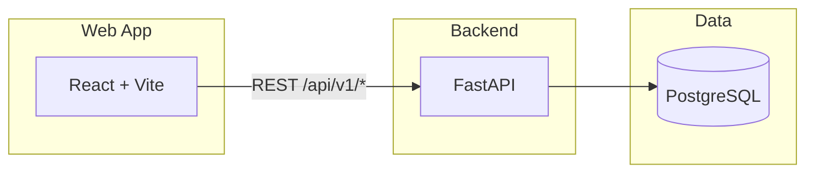

# RFC-001: Kept — Architecture, API & Frontend

**Status:** Draft  
**Created:** February 2026  
**Author:** Engineering  

---

## 1. Summary

This RFC defines the architecture, API contract, data model, and frontend approach for **Kept**, a web-first app for recording, categorizing, and visualizing personal expenses. The system uses a **React + Vite** frontend and a **Python FastAPI** backend (with **uv**), backed by **PostgreSQL**. The API is REST under `/api/v1/` with cursor-paginated ledger (sorted by transaction date descending), soft deletes for ledger and master data, tags as plain strings on entries with a suggestion store for autocomplete, and analytics endpoints for monthly and tag-based views. A single RFC covers both backend and frontend; this document is the source of truth for the contract and high-level UI.

---

## 2. Motivation and context

- **Product:** See [doc/prd.md](prd.md) for full requirements.
- **Goals:** Reliable ledger CRUD, charts (monthly, by category, by payment method), and custom total-by-tags; later expansion to mobile and optional multi-user.
- **Scope (v1):** Single-user or local-first; no auth; currency per payment method; tags as strings (no Tag entity).

---

## 3. Decisions

### 3.1 Tech stack

| Layer | Choice |
|-------|--------|
| **Frontend** | React 18, Vite, TypeScript, TanStack Query, Recharts, React Hook Form + Zod, Tailwind CSS, shadcn/ui (or similar) |
| **Backend** | Python 3.11+, **uv** (package manager), FastAPI, Pydantic v2, SQLAlchemy 2 (async) or equivalent ORM |
| **Database** | PostgreSQL 15+ |
| **Repo** | Monorepo: `apps/web`, `apps/api`, optionally `packages/shared` (e.g. OpenAPI-generated client) |

### 3.2 Data semantics

- **Refunds:** Stored as **negative amount**. Single “amount” field; no separate type enum. Analytics treat amount &gt; 0 as expense, amount &lt; 0 as refund.
- **Currency:** **Per payment method.** Ledger entry does not store currency; it is derived from the chosen payment method. API responses may include `currency` on entry by joining to payment method.
- **Ledger delete:** **Soft delete.** `deletedAt` timestamp; list and analytics exclude soft-deleted entries. `DELETE` sets `deletedAt = now()`.
- **Category / payment method “delete”:** **Soft delete.** `active: boolean` (or `deactivatedAt`). “Delete” = set inactive. Only active records appear in dropdowns for new entries; historical entries keep FK and display resolved name (e.g. “Cash”) even if the payment method is now inactive.
- **Tags:** **Not an entity.** Plain string array on ledger entry (`tags: string[]`). Multiple tags per entry. Suggestions for autocomplete come from a lightweight `tag_suggestions` store (see §5). No tag CRUD.

---

## 4. API contract

### 4.1 Base and versioning

- **Base path:** `/api/v1/`
- **Media type:** JSON only. `Content-Type: application/json`, `Accept: application/json`
- **Dates:** ISO 8601 date only: `YYYY-MM-DD`
- **Amounts:** JSON number; stored as `NUMERIC`/decimal in DB

### 4.2 Resource endpoints

| Method | Path | Description |
|--------|------|-------------|
| GET | `/api/v1/payment-methods` | List active payment methods (for dropdowns). |
| POST | `/api/v1/payment-methods` | Create payment method. |
| GET | `/api/v1/payment-methods/{id}` | Get one. |
| PUT | `/api/v1/payment-methods/{id}` | Update. |
| DELETE | `/api/v1/payment-methods/{id}` | Soft delete (set inactive). |
| GET | `/api/v1/categories` | List active categories. |
| POST | `/api/v1/categories` | Create category. |
| GET | `/api/v1/categories/{id}` | Get one. |
| PUT | `/api/v1/categories/{id}` | Update. |
| DELETE | `/api/v1/categories/{id}` | Soft delete (set inactive). |
| GET | `/api/v1/tag-suggestions` | Suggest tag strings (query param `q` optional). See §4.6. |
| GET | `/api/v1/ledger-entries` | List entries (cursor-paginated, sorted by date desc). See §4.4. |
| POST | `/api/v1/ledger-entries` | Create entry. |
| GET | `/api/v1/ledger-entries/{id}` | Get one. |
| PUT | `/api/v1/ledger-entries/{id}` | Update. |
| DELETE | `/api/v1/ledger-entries/{id}` | Soft delete. |

### 4.3 Request/response shapes (representative)

**PaymentMethod**

- Request (POST/PUT): `{ "name": string, "currency": string }` (currency required per decision).
- Response: `{ "id": string, "name": string, "currency": string, "active": boolean, "createdAt": string }`

**Category**

- Request: `{ "name": string, "color"?: string }`
- Response: `{ "id": string, "name": string, "color"?: string, "active": boolean, "createdAt": string }`

**LedgerEntry**

- Request (POST/PUT): `{ "date": "YYYY-MM-DD", "description": string, "categoryId": string, "paymentMethodId": string, "amount": number, "tags"?: string[] }`  
  - `amount`: signed (negative = refund). Currency comes from payment method.
- Response: `{ "id": string, "date": string, "description": string, "categoryId": string, "categoryName"?: string, "paymentMethodId": string, "paymentMethodName"?: string, "currency"?: string, "amount": number, "tags": string[], "createdAt": string, "updatedAt": string }`  
  - Include resolved names/currency for display; list endpoint returns same shape per item.

### 4.4 Ledger list (GET /api/v1/ledger-entries)

- **Pagination:** Cursor-based. Query params: `cursor` (opaque string, optional), `limit` (default 50, max 100).
- **Sort:** **Fixed:** always by **transaction date descending** (newest first). No `sort` query param.
- **Filter (optional):** `dateFrom`, `dateTo` (YYYY-MM-DD), `categoryId`, `paymentMethodId`, `type` (e.g. `expense` | `refund`; derive from sign of amount), `tags` (comma-separated strings; entries that contain **all** listed tags).
- **Response:** `{ "data": LedgerEntry[], "nextCursor": string | null }`. Omit `nextCursor` or set null when no next page.
- **Behaviour:** Exclude soft-deleted entries. Cursor is stable (e.g. based on `(date, id)` for deterministic ordering).

### 4.5 Analytics endpoints

- **GET /api/v1/analytics/monthly-expense?from=YYYY-MM-DD&to=YYYY-MM-DD**  
  Response: `{ "data": [ { "month": "YYYY-MM", "totalExpense": number, "totalRefund": number } ] }`  
  - `totalExpense`: sum of amounts where amount &gt; 0; `totalRefund`: absolute sum where amount &lt; 0. Or single `net` if preferred; RFC leaves exact shape to implementation.

- **GET /api/v1/analytics/expense-by-category?month=YYYY-MM**  
  Response: `{ "data": [ { "categoryId": string, "categoryName": string, "amount": number } ] }`  
  - Only positive amounts (expenses) in that month.

- **GET /api/v1/analytics/expense-by-payment-method?month=YYYY-MM**  
  Response: `{ "data": [ { "paymentMethodId": string, "paymentMethodName": string, "amount": number } ] }`

- **GET /api/v1/analytics/custom-by-tags?tags=work,reimbursable&from=YYYY-MM-DD&to=YYYY-MM-DD**  
  Response: `{ "totalExpense": number }`  
  - Sum of positive amounts for entries that have **all** given tags in the date range. Refunds (negative) can be excluded or netted; implementation choice.

- **GET /api/v1/analytics/dashboard?from=YYYY-MM-DD&to=YYYY-MM-DD**  
  Response: Summary for the range, e.g. `{ "totalExpense": number, "totalRefund": number, "entryCount": number }` plus optional `lastEntries`: LedgerEntry[] (e.g. last 5). Single composite endpoint recommended so the dashboard loads in one call.

### 4.6 Tag suggestions (GET /api/v1/tag-suggestions)

- **Query param:** `q` (optional). Prefix/substring match (case-insensitive) on suggestion store.
- **Response:** `{ "suggestions": string[] }` (e.g. max 20, ordered by recency of use).
- **Source:** Lightweight table `tag_suggestions(tag_text, last_used_at)` updated on ledger create/update (upsert per tag string). No CRUD API for this table.

### 4.7 Response envelope and errors

- **Success (list/single):** `200` with body `{ "data": T }`.
- **Create:** `201` with `Location: /api/v1/ledger-entries/{id}` and body `{ "data": T }`.
- **Validation:** `422 Unprocessable Entity` with body `{ "detail": [ { "loc": ["body", "field"], "msg": "..." } ] }` (FastAPI default).
- **Not found:** `404` with `{ "detail": "..." }`.

---

## 5. Data model and persistence

### 5.1 Tables

- **payment_methods:** id (PK), name, currency, active (boolean), created_at, (optional) updated_at.
- **categories:** id (PK), name, color (optional), active (boolean), created_at, (optional) updated_at.
- **ledger_entries:** id (PK), date (date), description (text), category_id (FK), payment_method_id (FK), amount (numeric), tags (TEXT[] or JSONB), created_at, updated_at, deleted_at (nullable).
- **tag_suggestions:** tag_text (PK or UNIQUE), last_used_at (timestamp). Updated implicitly on ledger create/update (upsert).

### 5.2 Behaviour

- Ledger list and all analytics **exclude** rows where `deleted_at IS NOT NULL`.
- List payment methods / categories for dropdowns: `WHERE active = true`. Historical entries keep FKs; join to show name even when inactive.
- **Indexes:** e.g. `ledger_entries(date DESC, id)`, `ledger_entries(deleted_at)`, and indexes supporting filters (category_id, payment_method_id). GIN index on `tags` if using array containment for tag filters.

### 5.3 Tag filter semantics

- Ledger filter `tags=work,reimbursable`: return entries whose `tags` array contains **all** of these strings (AND).
- Custom-by-tags: same — entries that have **all** given tags in the range; sum their (positive) amounts.

---

## 6. Implementation notes

### 6.1 Backend (Python, uv)

- **Tooling:** uv for dependency and lockfile (`pyproject.toml`, `uv.lock`). Run API with `uv run uvicorn app.main:app ...`.
- **Validation:** Amount: any number (negative allowed). Description: max length (e.g. 500). Date: valid ISO date (future allowed or not — product choice). Tags: array of non-empty strings, trim whitespace, max length per tag (e.g. 50). categoryId and paymentMethodId must reference existing records (active only for create).
- **Analytics:** On-demand queries for v1; no pre-aggregation. Add caching or materialized views later if needed.
- **OpenAPI:** FastAPI generates OpenAPI 3; expose at `/openapi.json` or `/docs`. Frontend can use `openapi-typescript` (or similar) to generate a typed client.

### 6.2 Frontend (see §7)

- Use generated API client or fetch with shared types. TanStack Query for server state; React Hook Form + Zod for forms. Recharts for bar/pie; month or range picker for analytics.

---

## 7. Frontend overview

### 7.1 Navigation and screens

- **Top-level:** Ledger | Dashboard | Payment methods | Categories | Custom query (or equivalent labels).
- **Screens:**  
  - **Ledger:** Table of entries (columns: date, description, category, payment method, amount, tags); row actions Edit, Delete; “Add entry” button; cursor “Load more” or infinite scroll.  
  - **Add/Edit entry:** Form with date, description, category (dropdown), payment method (dropdown), amount, tags (multi-value input with tag suggestions from `GET /api/v1/tag-suggestions?q=...`).  
  - **Dashboard:** Summary cards (from `GET /api/v1/analytics/dashboard?from=&to=`) and links to detailed charts.  
  - **Charts:** Monthly expense (bar); expense by category (bar/pie toggle); expense by payment method (bar/pie toggle). Month or date-range selector.  
  - **Payment methods / Categories:** List + add/edit/delete (soft delete); only active shown in dropdowns.  
  - **Custom query:** Tag multi-select (or comma-separated), date range; display total from `GET /api/v1/analytics/custom-by-tags?...`.

### 7.2 Key behaviours

- **Ledger:** Always request with cursor; sort is fixed (date desc) on backend. Show loading and empty state.
- **Tag input:** On input focus or typing, call tag-suggestions with `q`; show suggestions; allow free text (no strict “only from list”).
- **Charts:** Use Recharts; bar for time series and category/payment-method breakdown; pie for single-month breakdown. Toggle bar/pie where specified in PRD.
- **Delete confirmation:** Confirm before soft-deleting an entry; refresh list or invalidate query after delete.

### 7.3 State and data flow

- Server state: TanStack Query (ledger list, payment methods, categories, analytics). Invalidate or refetch after mutations (create/update/delete entry, update payment method/category).
- Local UI state: modals, filters (date range, category, etc.), chart type toggle. No duplicate “source of truth” for server data.

---

## 8. Security and multi-user (later)

- v1: No authentication; single-user or local-only usage.
- Future: Add auth (e.g. JWT or session); scope all data by user/tenant (e.g. `user_id` on payment_methods, categories, ledger_entries, tag_suggestions). API and data model changes to be covered in a follow-up RFC.

---

## 9. Open questions and follow-ups

- **Date range limits:** Max range for analytics (e.g. 1 year) to avoid heavy queries.
- **Max page size:** Cap `limit` at 100 for ledger list.
- **Dashboard “last entries”:** Number of entries to return (e.g. 5 or 10).
- **Idempotency:** Optional idempotency key for POST ledger-entries in a future revision.
- **PRD alignment:** PRD mentions “tags” as user-defined; this RFC implements tags as free-form strings with suggestions. Product may want to document that tags are not managed entities.

---

## Appendix: System context

